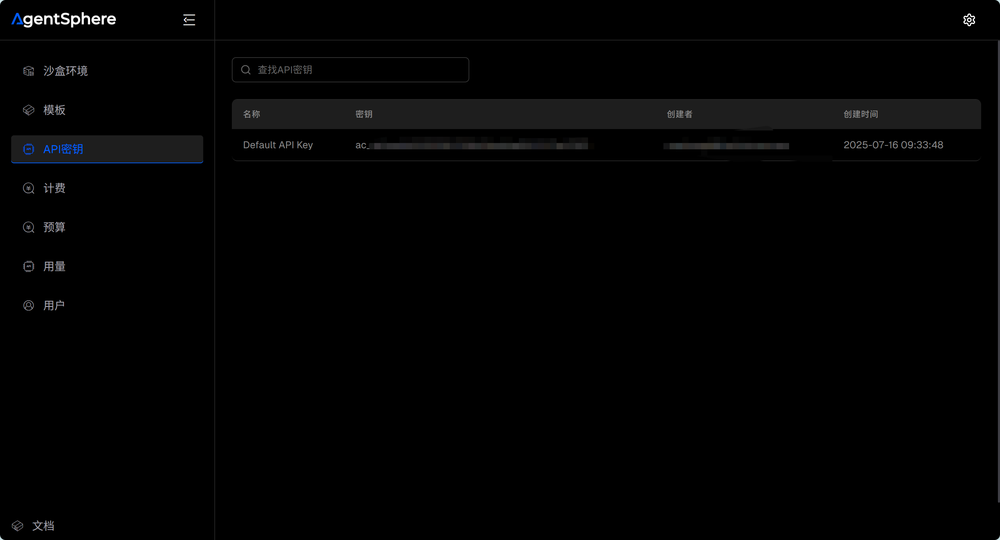
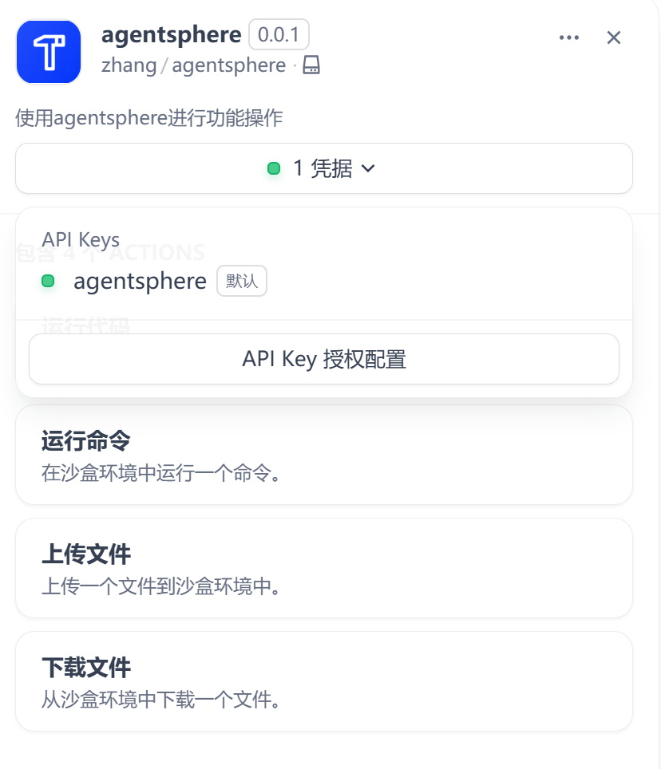
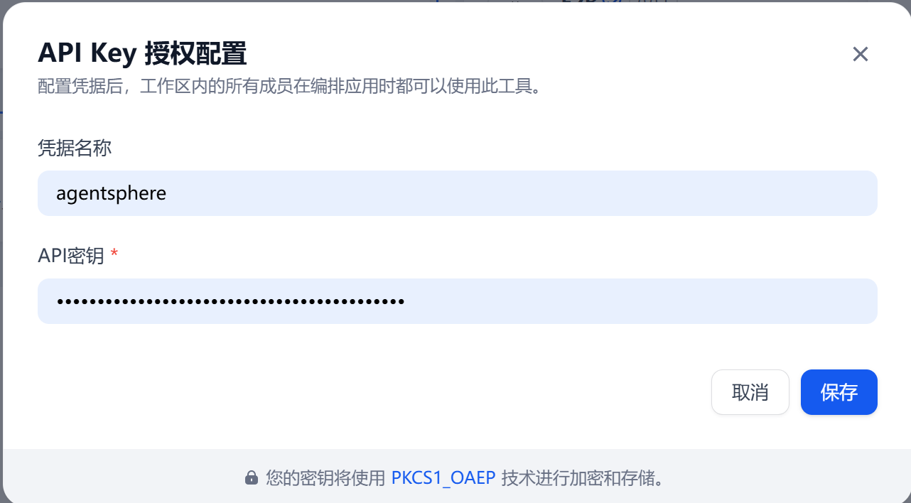
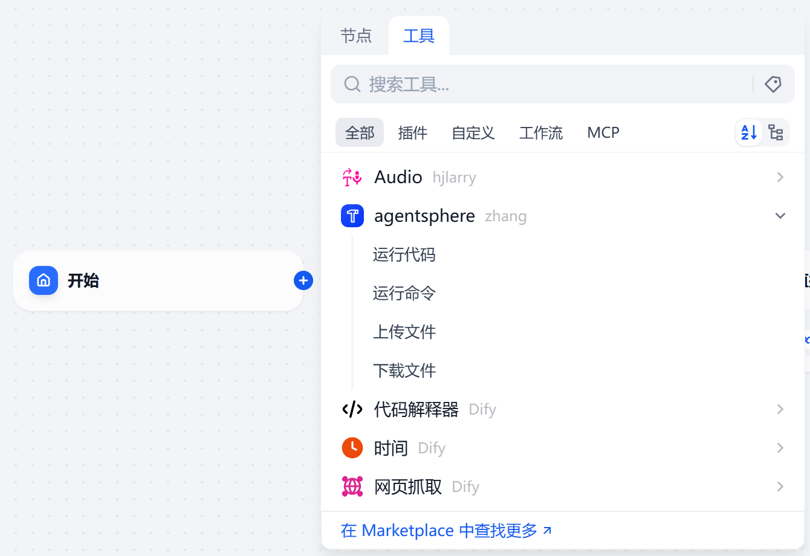
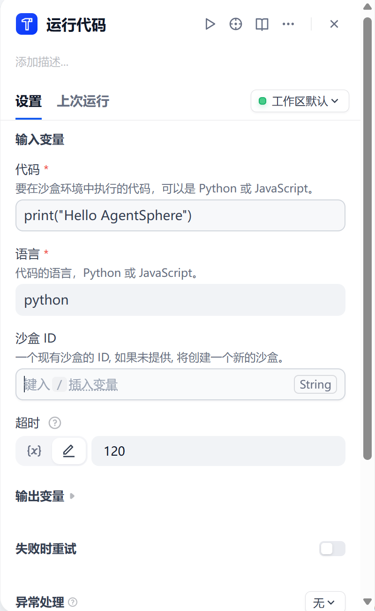
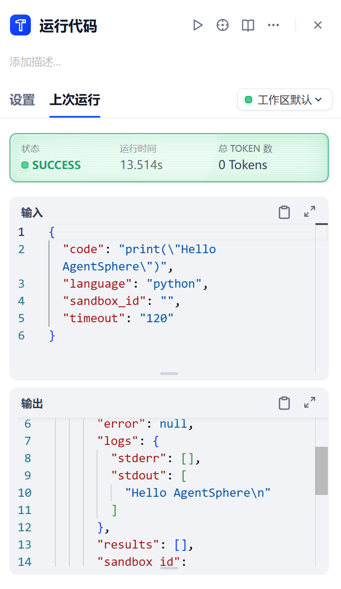
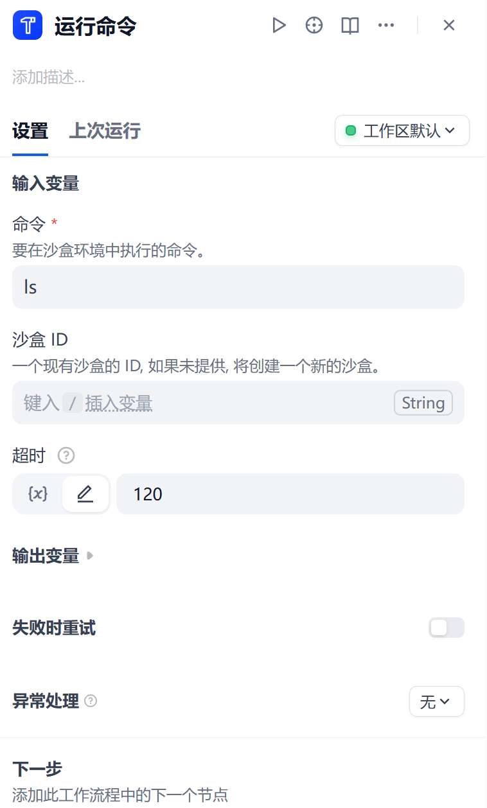
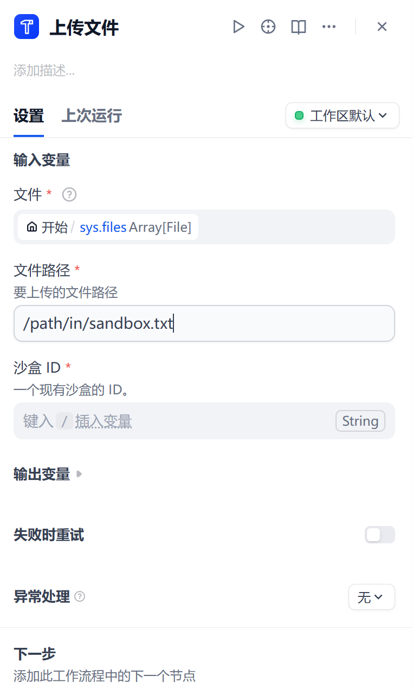
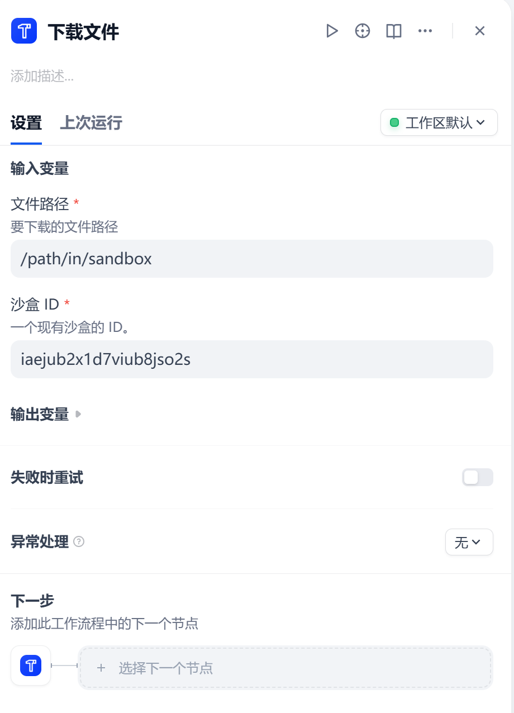

## agentsphere

This is an Agentsphere plugin designed for Dify, enabling seamless integration with the Agentsphere platform to provide users with secure sandbox environment operation capabilities.

## Contact Information

- Developer: zhang
- Email: sqzhangdi@isoftstone.com
- GitHub Account: https://github.com/zhangshanqi666
- Source Code Repository: https://github.com/zhangshanqi666/agentsphere-docs

### Core Features

- Execute code in an isolated sandbox environment
- Run commands in a secure sandbox environment
- Upload required files to the sandbox environment
- Download generated files from the sandbox environment

### Operation Guide

1. Login in to [the Agentsphere platform](https://www.agentsphere.run/) and obtain your API key from the "Key Management" page.

2. Install this plugin in Dify, click the "Authorize" button, enter your API key, and then click "Confirm Authorization" to complete the binding.

3. After authorization, you can use the plugin in your workflows or other applications.

#### Code Execution

Currently supports the execution of code in two programming languages: Python and JavaScript.

#### Command Execution

You can safely run Linux system commands in the sandbox environment.

#### File Transfer

- Upload files to the sandbox environment

- 
Download files from the sandbox environment

Please note that the above two file operations need to be performed in an already created sandbox environment.
